<p align="center">
  
</p>
<p align="center"> <b>English</b> · <a href="./README.zh-CN.md">简体中文</a> </p>
<p align="center">
  <a href="https://github.com/kgpp34/KumaBox/actions/workflows/ci.yml"></a>
  
  
  <a href="LICENSE"></a>
</p>

<p align="center">
  <a href="#quick-start">Quick start</a> ·
  <a href="#architecture">Architecture</a> ·
  <a href="#how-kumabox-compares">Comparison</a> ·
  <a href="#roadmap">Roadmap</a>
</p>

AI agents write code, install packages, open network connections and touch
files nobody reviewed. Running that on a shared kernel is a bet. KumaBox gives
every task its own **KVM microVM** with its own kernel, disk and network
namespace, and gets you from an OCI image to a running sandbox in one command.

> [!WARNING]
> KumaBox is under active development. The CLI, metadata schema and snapshot
> format are not yet covered by a stability guarantee. Use disposable Linux/KVM
> hosts until the first stable release.

## What KumaBox is

<p align="center"></p>

KumaBox is a **microVM sandbox runtime for AI agents and untrusted
workloads**. It handles images, VM lifecycle, networking, snapshots, devices and
guest execution end to end, so you work with sandboxes rather than raw VMMs.
Anything that can run a command can drive it today: a coding agent, an agent framework's tool call,
an RL or eval harness fanning out thousands of attempts, a CI job, or you at a
terminal.

Each sandbox is a real machine:

- **Hardware isolation.** A dedicated guest kernel behind KVM, with one Cloud Hypervisor process per VM.
- **OCI in, microVM out.** Digest-pinned OCI images become shared, read-only EROFS layers plus a private copy-on-write disk per VM.
- **Real networking.** A network namespace per VM, multiqueue TAP and tc redirect through CNI, multiple NICs, live NIC resize.
- **Guest execution without SSH.** `exec` over vsock with streamed stdout and stderr, stdin, env, workdir, TTY and real exit codes.
- **Snapshots as first-class artifacts.** Stopped or running snapshots that you can verify, export, import, restore, hibernate, or clone with a fresh identity.
- **Real devices when you need them.** Hotplug data disks, virtio-fs shares and VFIO PCI passthrough, for example a GPU.
- **Built to be scripted.** `--json` output, versioned dry-run launch plans (`kumabox debug launch`) and per-VM usage intervals (`kumabox usage`).

## Architecture

<p align="center"></p>

**Lightweight control plane.** Every `kumabox` call opens durable state, takes
resource locks, performs the operation and records the result. Each running VM
is backed by its own Cloud Hypervisor process, so one sandbox can never take
down another.

**Crash-consistent, by design.** Multi-step changes are recorded in one
operation journal covering VM lifecycle, network, devices, snapshots, clone,
restore and hibernate. If a command is killed halfway, the next command
reconciles the records against the real VMM and host-network state. Named
fault-injection points across metadata, network, snapshot, clone, delete and GC
boundaries are exercised in tests.

**Switchable metadata.** JSON by default. SQLite when you need heavier
concurrency, with `metadata status`, `metadata verify` and verified backups.

| Path | Purpose |
| --- | --- |
| `/var/lib/kumabox` | Images, VM records, snapshots, network leases, content |
| `/var/lib/kumabox/run` | PID files, API sockets, native restore staging |
| `/var/log/kumabox` | VM and runtime logs |

## Warm once, fork many

<p align="center"></p>

Agents retry, branch and explore. Pay the setup cost once: boot, install
dependencies, warm caches. Capture a **running snapshot** of memory and disks,
then `clone` it for every attempt. Each clone gets a new network identity and a
reseeded guest identity and entropy pool, so clones do not accidentally share
secrets. Memory restore is selectable with `--restore-mode copy|ondemand|mmap`.

## Quick start

You need Linux amd64 or arm64 with `/dev/kvm`, and root.

```bash
# 1. Install and verify the release
curl -fsSLO https://github.com/kgpp34/KumaBox/releases/latest/download/kumabox-install.sh
curl -fsSLO https://github.com/kgpp34/KumaBox/releases/latest/download/kumabox-install.sh.sha256
sha256sum --check kumabox-install.sh.sha256
sudo sh kumabox-install.sh

# 2. Prepare the host once: Cloud Hypervisor, firmware, CNI plugins, EROFS tools
sudo kumabox-check --upgrade
sudo kumabox doctor

# 3. Build the published guest image
sudo kumabox image build ghcr.io/kgpp34/kumabox/ubuntu:24.04 --name ubuntu

# 4. Run a sandbox and talk to it
sudo kumabox run ubuntu --name my-vm --cpus 2 --memory 1G --storage 4G
sudo kumabox exec my-vm -- uname -a
sudo kumabox exec -it my-vm -- sh

# 5. Warm once, fork many
sudo kumabox snapshot create my-vm --name base --type running
sudo kumabox clone base --name fresh
sudo kumabox exec fresh -- hostname

# 6. Clean up
sudo kumabox delete fresh my-vm --force
sudo kumabox snapshot rm base
sudo kumabox image rm ubuntu
sudo kumabox gc
```

Host and guest artifacts are a matched release pair. Pin a versioned guest tag
such as `24.04-v0.1.0`, or an OCI digest, when reproducibility matters.
`sudo kumabox-check` alone performs a read-only host audit.

### Drive it from an agent

`exec --json` prints `ok`, `exitCode`, and base64-encoded `stdout` and `stderr`.
The process exit code mirrors the guest command's exit code.

```python
import base64, json, subprocess

def run_in_sandbox(vm: str, script: str, timeout: str = "120s") -> dict:
    proc = subprocess.run(
        ["sudo", "kumabox", "exec", "--json", "--timeout", timeout,
         vm, "--", "sh", "-c", script],
        capture_output=True, text=True,
    )
    result = json.loads(proc.stdout)
    for key in ("stdout", "stderr"):
        result[key] = base64.b64decode(result.get(key) or "").decode(errors="replace")
    return result

print(run_in_sandbox("fresh", "echo hello from $(hostname)"))
```

Fan out parallel attempts from one warm snapshot:

```bash
for i in $(seq 1 8); do
  sudo kumabox clone base --name try-$i &
done
wait
sudo kumabox ps
```

The published Ubuntu guest is intentionally minimal. To bake in your own
toolchain (Python, Node, browsers), extend
[`oci-images/ubuntu/24.04/Dockerfile`](oci-images/ubuntu/24.04/Dockerfile),
which already installs the matching `kumabox-agent`, kernel and initramfs.

## Core commands

| Area | Commands |
| --- | --- |
| VM lifecycle | `run`, `create`, `start`, `stop`, `pause`, `resume`, `delete`, `ps`, `inspect` |
| Guest access | `exec`, `console`, `logs`, `agent status`, `agent ping`, `agent reseed` |
| Images | `image build`, `image add`, `image pull-oci`, `image pull`, `image import`, `image inspect`, `image ls`, `image rm` |
| Snapshots | `snapshot create`, `snapshot verify`, `snapshot export`, `snapshot import`, `restore`, `clone`, `hibernate` |
| Networking | `network inspect`, `network setup`, `network teardown`, `network resize` |
| Devices | `disk attach/detach/list`, `fs attach/detach/list`, `device attach/detach/list/state` |
| Operations | `doctor`, `metadata`, `usage`, `gc`, `debug launch` |

`kumabox <command> --help` is the authoritative reference.

## How KumaBox compares

<p align="center"></p>

[E2B](https://github.com/e2b-dev/infra) and
[CubeSandbox](https://github.com/TencentCloud/CubeSandbox) are excellent
projects that share KumaBox's goal of giving every agent task its own kernel.
KumaBox takes a different path in a few places:

- **VM-native, not container-shaped.** Sandboxes are real VMs with the full device model of Cloud Hypervisor: hotplug disks, virtio-fs shares, live NIC resize and VFIO PCI passthrough for GPUs and other accelerators.
- **Snapshots you can hold.** A running snapshot is a verifiable, portable package. Export it, move it to another host, import it and clone from it.
- **Layered images, shared on disk.** OCI layers become read-only EROFS images shared by every VM on the host; each VM only pays for its own copy-on-write writes.
- **Minimal to install.** One Go binary plus Cloud Hypervisor and CNI plugins. Metadata lives in JSON or embedded SQLite, with no external database, cache or object store to operate.
- **Correctness you can audit.** A single operation journal and named fault-injection points cover lifecycle, network, snapshot, clone and GC paths.
- **MIT licensed**, on amd64 and arm64.

Related projects: [Kata Containers](https://katacontainers.io/),
[gVisor](https://gvisor.dev/),
[Firecracker](https://firecracker-microvm.github.io/),
[Cloud Hypervisor](https://www.cloudhypervisor.org/) and
[Cocoon](https://github.com/cocoonstack/cocoon).

## Vision

Every agent action should get a disposable computer that is as cheap to fork as
a git branch and as safe as a separate machine. KumaBox builds that from the
bottom up: first a correct, crash-consistent runtime on every host, then a
long-running service and a multi-node control plane on top of the same
journal and metadata, so a sandbox behaves the same on a laptop-sized server
and across a fleet.

## Roadmap

> Proposed direction. Open an issue to weigh in.

- [x] OCI to EROFS images, CNI networking, guest exec over vsock
- [x] Running snapshots, clone, restore, hibernate, export and import
- [x] Hotplug disks, virtio-fs, VFIO PCI; JSON and SQLite metadata
- [ ] Daemon mode with an HTTP API
- [ ] Multi-node control plane and scheduling
- [ ] Go, Python and TypeScript SDKs
- [ ] E2B-compatible API, so existing E2B code can point at KumaBox
- [ ] MCP server, so agents can create and drive sandboxes as tools
- [ ] Warm pools and published clone-latency benchmarks
- [ ] Per-sandbox egress policy

## Build and test

```bash
git clone https://github.com/kgpp34/KumaBox.git && cd KumaBox
make build
make test
go vet ./...
./bin/kumabox version --json
```

The E2E suite needs a Linux/KVM host and exercises OCI image creation, cold
boot, guest exec and TTY, CNI allocation and cleanup, stopped and native
snapshots, clone and restore, disk hotplug and metadata backup:

```bash
GO_BIN="$(go env GOROOT)/bin/go"
sudo test/e2e/e2e.sh --go-bin "$GO_BIN" --metadata-backend sqlite
sudo test/e2e/e2e.sh --go-bin "$GO_BIN" --metadata-backend json
```

README graphics are generated from code. Edit the scripts in
`assets/readme/src/` and run `python3 assets/readme/src/build.py`.

## Security model

- KumaBox adds a VM boundary, but the VMM, KVM, guest kernel, firmware, images and agent remain in the trusted computing base.
- Host setup changes privileged networking and system configuration. Review `scripts/check.sh` before running `--fix` or `--upgrade`.
- VFIO hands a physical device to a guest and requires correct IOMMU grouping; misuse can affect host stability and isolation.
- Snapshot compatibility depends on host architecture, Cloud Hypervisor version, VM configuration and capture mode.

Report reproducible bugs and security concerns through the issue tracker. Do
not attach secrets, private images or production snapshots.

## License

KumaBox is available under the [MIT License](LICENSE).
