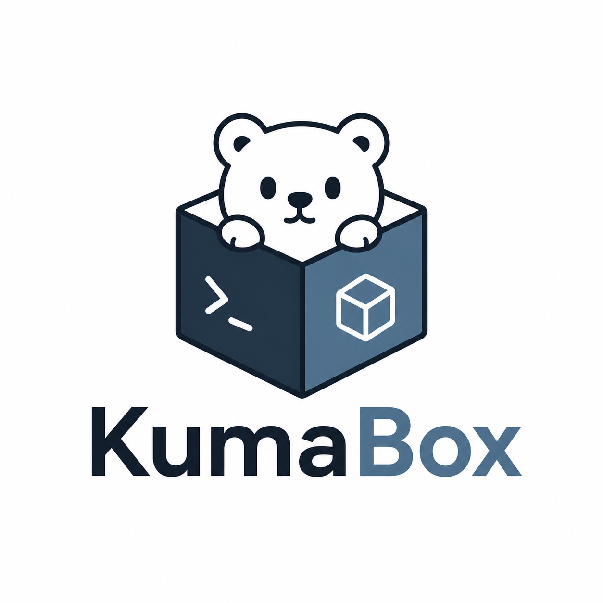

<p align="center">
  
</p>

# KumaBox

KumaBox is a daemonless microVM sandbox runtime for agents, automation, and
untrusted workloads. It runs OCI images inside Cloud Hypervisor VMs on KVM and
provides a container-like CLI for lifecycle, networking, command execution,
snapshots, cloning, and device management.

[](https://github.com/kgpp34/KumaBox/actions/workflows/ci.yml)
[](https://go.dev/)
[](https://www.kernel.org/)
[](LICENSE)

> [!WARNING]
> KumaBox is under active development. The CLI, metadata schema, and snapshot
> format are not yet covered by a stable compatibility guarantee. Use it on
> disposable Linux/KVM hosts until the first stable release.

## Highlights

- **MicroVM isolation**: each sandbox runs behind KVM in its own Cloud
  Hypervisor process instead of sharing the host kernel.
- **Daemonless control plane**: commands open durable state, lock the affected
  resources, perform one operation, and exit. No KumaBox service is required.
- **OCI direct boot**: OCI layers are converted to shared EROFS images and
  combined with a private writable disk for each VM.
- **Guest execution**: run commands, stream stdin/stdout/stderr, allocate a TTY,
  and update guest identity through the vsock agent.
- **CNI networking**: the default `cni:kumabox` network supports per-VM
  namespaces, TAP devices, multi-NIC configuration, cleanup, and reconciliation.
- **Snapshots and clones**: capture stopped or running VMs, export and import
  snapshots, restore in place, hibernate, or clone with a fresh identity.
- **Runtime devices**: attach data disks, virtio-fs shares, and VFIO PCI devices
  where the host and Cloud Hypervisor configuration support them.
- **Switchable metadata**: JSON is the default; SQLite is available for stronger
  concurrent access, backup, and integrity checks.

## Positioning

KumaBox is a sandbox manager, not a Kubernetes container runtime and not a VMM
library. The projects below operate at different layers:

| Project | Interface presented to users | Isolation model | Primary use case |
| --- | --- | --- | --- |
| **KumaBox** | Daemonless VM-oriented CLI | KVM microVM through Cloud Hypervisor | Local agent sandboxes, automation, and explicit VM lifecycle management |
| [Kata Containers](https://katacontainers.io/) | OCI/CRI container runtime | Lightweight VM containing the container workload | Adding VM isolation to containerd, CRI, and Kubernetes workflows |
| [gVisor](https://gvisor.dev/) | OCI runtime (`runsc`) | Userspace application kernel; not a traditional guest VM | Sandboxing containers while retaining Docker/Kubernetes integration |
| [Firecracker](https://firecracker-microvm.github.io/) | VMM process and API | KVM microVM with a deliberately minimal device model | Building serverless or container platforms that provide their own control plane |
| [Cloud Hypervisor](https://www.cloudhypervisor.org/) | VMM process and API | KVM/MSHV VM optimized for modern cloud workloads | Building VM products; KumaBox uses it as its current backend |
| [Cocoon](https://github.com/cocoonstack/cocoon) | Daemonless VM-oriented CLI | MicroVM through Cloud Hypervisor or Firecracker | A broader, more mature direct alternative in the same product category |

Kata Containers is therefore not simply "a container running a nested VM."
Container tooling calls the Kata runtime, and Kata places the workload inside a
lightweight VM while preserving the expected container interface. Choose Kata
when CRI/containerd/Kubernetes compatibility is the primary requirement. Choose
gVisor when a userspace-kernel sandbox fits that container workflow. Choose a
raw VMM when you are building the surrounding image, network, metadata, and
lifecycle control plane yourself.

KumaBox is intended for users who want to manage the sandbox directly as a VM
without first deploying Kubernetes or a resident KumaBox daemon. It is not a
drop-in OCI runtime replacement for Kata or gVisor, and its current backend and
platform coverage are narrower than established projects.

## Quick Start

KumaBox currently supports Linux amd64 and arm64 hosts. The setup command
installs pinned Cloud Hypervisor, firmware, CNI plugins, EROFS tooling, and the
default `cni:kumabox` network.

```bash
# Install the latest release and verify its checksum.
curl -fsSLO https://github.com/kgpp34/KumaBox/releases/latest/download/kumabox-install.sh
curl -fsSLO https://github.com/kgpp34/KumaBox/releases/latest/download/kumabox-install.sh.sha256
sha256sum --check kumabox-install.sh.sha256
sudo sh kumabox-install.sh

# Prepare and verify the host once.
sudo kumabox-check --upgrade
sudo kumabox doctor

# Import the published OCI guest image.
sudo kumabox image build \
  ghcr.io/kgpp34/kumabox/ubuntu:24.04 \
  --name ubuntu

# Start a VM on the default CNI network.
sudo kumabox run ubuntu \
  --name my-vm \
  --cpus 2 \
  --memory 1G \
  --storage 4G

# Interact with the guest. Run console in a separate terminal when needed.
sudo kumabox exec my-vm -- uname -a
sudo kumabox exec -it my-vm -- sh
sudo kumabox console my-vm

# Capture running state and create an independent clone.
sudo kumabox snapshot create my-vm --name base --type running
sudo kumabox clone base --name fresh
sudo kumabox exec fresh -- hostname

# Clean up.
sudo kumabox delete fresh my-vm --force
sudo kumabox snapshot rm base
sudo kumabox image rm ubuntu
sudo kumabox gc
```

The host and guest artifacts are a matched release pair. Pin a versioned guest
tag such as `24.04-v0.1.0`, or an OCI digest, when reproducibility matters.

## How It Works

```text
kumabox command
      |
      +-- open JSON or SQLite metadata
      +-- acquire process/resource locks
      +-- prepare OCI layers, writable disks, and CNI networking
      +-- start or control one Cloud Hypervisor process
      +-- communicate with the guest agent over vsock
      +-- persist the result and exit
```

Durable data lives under `/var/lib/kumabox`, runtime sockets and native restore
staging under `/var/lib/kumabox/run`, and logs under `/var/log/kumabox`.
KumaBox reconciles these records with observed VMM and host-network state after
an interrupted command or host restart.

## Requirements

| Component | Requirement |
| --- | --- |
| Host | Linux amd64 or arm64 |
| Virtualization | Hardware virtualization and accessible `/dev/kvm` |
| VMM | Cloud Hypervisor |
| Disk tools | `qemu-img`, ext4 tools, and `mkfs.erofs` 1.8+ |
| Networking | `/dev/net/tun`, `ip`, CNI plugins, and host forwarding |
| Privileges | Root for KVM, TAP/CNI, device, and system-state operations |
| Source builds | Go 1.24.4 or newer |

Run `sudo kumabox-check` for a read-only host audit. Run
`sudo kumabox-check --fix` to create missing KumaBox directories and network
configuration without upgrading pinned dependencies.

## Core Commands

| Area | Commands |
| --- | --- |
| VM lifecycle | `run`, `create`, `start`, `stop`, `pause`, `resume`, `delete`, `ps`, `inspect` |
| Guest access | `exec`, `console`, `logs`, `agent` |
| Images | `image add`, `image build`, `image pull`, `image inspect`, `image ls`, `image rm` |
| Snapshots | `snapshot create`, `snapshot verify`, `snapshot export`, `snapshot import`, `restore`, `clone`, `hibernate` |
| Networking | `network inspect`, `network setup`, `network teardown`, `network resize` |
| Devices | `disk`, `fs`, `device` |
| Operations | `doctor`, `metadata`, `usage`, `gc`, `debug` |

Use `kumabox <command> --help` as the authoritative CLI reference. Inspection
and automation-oriented commands support structured JSON output where shown by
their help.

## Metadata Backends

JSON metadata is used by default:

```bash
sudo kumabox ps
```

Select SQLite consistently for every command that accesses the same state:

```bash
sudo kumabox --metadata-backend sqlite metadata init
sudo kumabox --metadata-backend sqlite run ubuntu --name sqlite-vm --storage 4G
sudo kumabox --metadata-backend sqlite ps
sudo kumabox --metadata-backend sqlite metadata backup /var/lib/kumabox/metadata-backup.db
```

Do not switch backends for an existing resource set without using the metadata
conversion workflow exposed by `kumabox metadata --help`.

## Build and Test

```bash
git clone https://github.com/kgpp34/KumaBox.git
cd KumaBox
make build
make test
go vet ./...
./bin/kumabox version --json
```

The full test suite requires a Linux/KVM host and exercises OCI image creation,
cold boot, guest exec and TTY, CNI allocation and cleanup, stopped and native
snapshots, clone/restore, disk hotplug, and metadata backup:

```bash
GO_BIN="$(go env GOROOT)/bin/go"

sudo test/e2e/e2e.sh \
  --go-bin "$GO_BIN" \
  --metadata-backend sqlite

sudo test/e2e/e2e.sh \
  --go-bin "$GO_BIN" \
  --metadata-backend json
```

The E2E script uses KumaBox's fixed system paths and reserved `e2e-*` resource
names. It reuses an existing managed E2E image unless `--rebuild-image` is
specified.

## Security and Limitations

- KumaBox improves workload isolation by adding a VM boundary, but the VMM,
  KVM, guest kernel, firmware, image, agent, and host integrations remain in the
  trusted computing base.
- Host setup changes privileged networking and system configuration. Review
  `scripts/check.sh` before running `--fix` or `--upgrade`.
- VFIO passes a physical device to a guest and requires correct IOMMU grouping;
  misuse can affect host stability and isolation.
- Snapshot compatibility depends on the host architecture, Cloud Hypervisor
  version, VM configuration, and capture mode.
- Cloud Hypervisor is the only supported VMM backend. Firecracker is not part of
  the current release scope.

Report reproducible bugs and security concerns through the repository issue
tracker. Do not include secrets, private images, or production snapshots in a
public report.

## License

KumaBox is available under the [MIT License](LICENSE).
