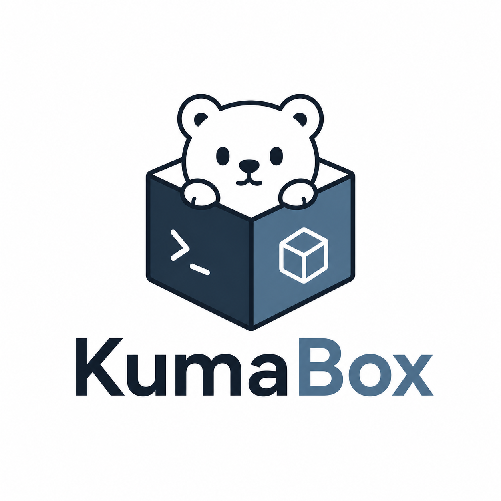

<p align="center">
  
</p>
<p align="center"> <b>English</b> · <a href="./README.zh-CN.md">简体中文</a> </p>
<p align="center">
  <a href="https://github.com/kgpp34/KumaBox/actions/workflows/ci.yml"></a>
  
  
  <a href="LICENSE"></a>
</p>

<p align="center">
  <a href="#quick-start">Quick start</a> ·
  <a href="#architecture">Architecture</a> ·
  <a href="#how-kumabox-compares">Comparison</a> ·
  <a href="#roadmap">Roadmap</a>
</p>

AI agents write code, install packages, open network connections and touch
files nobody reviewed. Running that on a shared kernel is a bet. KumaBox gives
every task its own **KVM microVM** with its own kernel, disk and network
namespace, and gets you from an OCI image to a running sandbox in one command.

> [!WARNING]
> KumaBox is under active development. The CLI, metadata schema and snapshot
> format are not yet covered by a stability guarantee. Use disposable Linux/KVM
> hosts until the first stable release.

## What KumaBox is

<p align="center"></p>

KumaBox is a **microVM sandbox runtime for AI agents and untrusted
workloads**. It handles images, VM lifecycle, networking, snapshots and
guest execution end to end, so you work with sandboxes rather than raw VMMs.
Anything that can run a command can drive it today: a coding agent, an agent framework's tool call,
an RL or eval harness fanning out thousands of attempts, a CI job, or you at a
terminal.

Each sandbox is a real machine:

- **Hardware isolation.** A dedicated guest kernel behind KVM, with one Cloud Hypervisor process per VM.
- **OCI in, microVM out.** Digest-pinned OCI images become shared, read-only EROFS layers plus a private copy-on-write disk per VM.
- **Real networking.** A network namespace per VM, multiqueue TAP and CNI, with multiple NICs at creation.
- **Guest execution without SSH.** `exec` over vsock with streamed stdout and stderr, optional stdin and environment variables, and real exit codes.
- **Snapshots as first-class artifacts.** Save a running VM, restore or hibernate it, clone it with a fresh network identity, or export and import it as a portable archive.
- **Runtime devices.** Attach external raw disks, virtio-fs shares and VFIO PCI devices to a running Cloud Hypervisor VM.
- **Built to be scripted.** Lifecycle commands offer JSON output and `inspect` returns indented JSON.

## Architecture

<p align="center"></p>

**Lightweight control plane.** Every `kumabox` call opens durable state, takes
resource locks, performs the operation and records the result. Each running VM
is backed by its own Cloud Hypervisor process, so one sandbox can never take
down another.

**Durable lifecycle.** SQLite records sandbox and snapshot states. Operations
stage artifacts privately, publish complete results, and retain ownership when
cleanup must be retried.

| Path | Purpose |
| --- | --- |
| `/var/lib/kumabox` | Images, VM records, snapshots, network leases, content |
| `/run/kumabox` | PID files, API sockets, operation locks |
| `/var/log/kumabox` | VM and runtime logs |

## Warm once, fork many

<p align="center"></p>

Agents retry, branch and explore. Pay the setup cost once: boot, install
dependencies, warm caches. Capture a **running snapshot** of memory and disks,
then `clone` it for every attempt. Each clone gets a private writable disk,
network identity and hostname. Cloud Hypervisor v53 uses on-demand memory
restore; newer compatible versions can use copy-on-write memory restore.

## Quick start

You need Linux amd64 or arm64 with `/dev/kvm`, and root.

```bash
# 1. Build and install
git clone https://github.com/kgpp34/KumaBox.git && cd KumaBox
make build
sudo install -m 0755 bin/kumabox /usr/local/bin/kumabox
sudo install -m 0755 bin/kumabox-check /usr/local/bin/kumabox-check

# 2. Prepare the host once: Cloud Hypervisor, firmware, CNI plugins, EROFS tools
sudo kumabox-check --upgrade
sudo kumabox doctor

# 3. Pull the published guest image
sudo kumabox image pull ghcr.io/kgpp34/kumabox/ubuntu:24.04

# 4. Run a sandbox and talk to it
sudo kumabox create ghcr.io/kgpp34/kumabox/ubuntu:24.04 --name my-vm --cpus 2 --memory 1GiB --storage 10GiB
sudo kumabox start my-vm
sudo kumabox exec my-vm -- uname -a

# 5. Warm once, fork many
sudo kumabox snapshot save my-vm --name base
sudo kumabox clone base --name fresh
sudo kumabox net fresh --configure
sudo kumabox exec fresh -- hostname
sudo kumabox snapshot export base --output base.tar

# 6. Clean up
sudo kumabox stop fresh
sudo kumabox stop my-vm
sudo kumabox rm fresh
sudo kumabox rm my-vm
sudo kumabox snapshot rm base
sudo kumabox image remove ghcr.io/kgpp34/kumabox/ubuntu:24.04
```

`clone` returns after the VM resumes. Run `net SANDBOX --configure` to apply
the clone's hostname and allocated NIC settings in the guest, or use
`clone --wait-network` to include that step before the command returns. The
default path renews guest entropy and machine ID in a detached process.

Host and guest artifacts are a matched release pair. Pin a versioned guest tag
such as `24.04-v0.1.0`, or an OCI digest, when reproducibility matters.
`sudo kumabox-check` alone performs a read-only host audit.

### Share a host directory with virtio-fs

Create the sandbox with `--shared-memory`; this VM setting cannot be enabled
after creation. On Ubuntu 24.04, install the `virtiofsd` package and start its
server for the directory you want to share:

```bash
sudo apt-get install virtiofsd
sudo install -d /tmp/kumabox-share
sudo /usr/libexec/virtiofsd --socket-path=/tmp/kumabox-share.sock \
  --shared-dir=/tmp/kumabox-share --cache=never &

sudo kumabox run ghcr.io/kgpp34/kumabox/ubuntu:24.04 \
  --name share-vm --shared-memory
sudo kumabox fs attach share-vm --socket /tmp/kumabox-share.sock --tag data
sudo kumabox fs list share-vm --json
sudo kumabox exec share-vm -- sh -c \
  'mkdir -p /mnt/data && mount -t virtiofs data /mnt/data && echo hello >/mnt/data/hello'
sudo cat /tmp/kumabox-share/hello

sudo kumabox exec share-vm -- umount /mnt/data
sudo kumabox fs detach share-vm --tag data
sudo kumabox stop share-vm
sudo kumabox rm share-vm
```

`fs list` and `inspect` report live attachments. A share lasts only for the
current VM process; after stop or restart, start a fresh `virtiofsd` and attach
again. Unmount and detach it before `snapshot save` or `hibernate`.

### Drive it from an agent

`exec` streams guest output and preserves the guest command's exit code.

```python
import subprocess

def run_in_sandbox(vm: str, script: str) -> subprocess.CompletedProcess[str]:
    proc = subprocess.run(
        ["sudo", "kumabox", "exec", vm, "--", "sh", "-c", script],
        capture_output=True, text=True,
    )
    return proc

result = run_in_sandbox("fresh", "hostname")
print(result.returncode, result.stdout, result.stderr)
```

Fan out parallel attempts from one warm snapshot:

```bash
for i in $(seq 1 8); do
  sudo kumabox clone base --name try-$i &
done
wait
sudo kumabox ps
```

The published Ubuntu guest is intentionally minimal. To bake in your own
toolchain (Python, Node, browsers), extend
[`oci-images/ubuntu/Dockerfile`](oci-images/ubuntu/Dockerfile),
which already installs the matching `kumabox-agent`, kernel and initramfs.

For latency-sensitive Linux guests that do not need loadable kernel modules,
build the optional single-layer fast-boot image from the same source tree:

```bash
docker build -f oci-images/ubuntu/Dockerfile -t kumabox/ubuntu:24.04 .
docker build -f oci-images/fastboot/Dockerfile.boot -t kumabox/boot:fast .
docker build -f oci-images/fastboot/Dockerfile.image -t kumabox/ubuntu:fast .
docker save kumabox/ubuntu:fast -o /tmp/kumabox-ubuntu-fast.tar
sudo kumabox image import ubuntu-fast /tmp/kumabox-ubuntu-fast.tar --format docker
```

The fast profile has its own built-in kernel and initramfs; use the general
Ubuntu image for workloads that require kernel modules or passthrough drivers.

## Remote API and SDKs

`kumabox serve` opens the same application services through an authenticated,
versioned HTTP API. It binds to `127.0.0.1:8765` by default. Keep it on loopback
and use an SSH tunnel or TLS reverse proxy for remote clients:

```bash
sudo sh -c 'umask 077; openssl rand -hex 32 > /etc/kumabox-api.token'
sudo kumabox serve --token-file /etc/kumabox-api.token
# On a client machine: ssh -L 8765:127.0.0.1:8765 user@kumabox-host
```

The Python and TypeScript SDKs live in `sdk/python` and `sdk/typescript`.
Both expose `create`, `connect`, `commands.run`, lifecycle methods and snapshots.
The image must already be imported or pulled on the host.
Nonzero guest exits raise `CommandExitError` with captured output; pass
`check=False` in Python or `{ check: false }` in TypeScript to inspect the exit code directly.
Install the Python package with `python -m pip install ./sdk/python`. Build the
TypeScript package with `npm ci --prefix sdk/typescript && npm run build --prefix sdk/typescript`,
then install it into your application from `./sdk/typescript`.

```python
from kumabox import Client

client = Client(token="YOUR_API_TOKEN")
sandbox = client.create("my-image")
print(sandbox.commands.run("uname -a").stdout)
sandbox.stop()
sandbox.kill()
```

```ts
import { Client } from '@kumabox/sdk'

const client = new Client({ token: process.env.KUMABOX_API_TOKEN! })
const sandbox = await client.create('my-image')
console.log((await sandbox.commands.run('uname -a')).stdout)
await sandbox.stop()
await sandbox.kill()
```

An **experimental E2B protocol adapter** also accepts control-plane create,
connect, inspect, kill and snapshot calls (including creating a sandbox from a
saved snapshot), plus foreground `commands.run` over envd's
Connect JSON process stream. Point `E2B_API_URL` and `E2B_SANDBOX_URL` at the
same tunneled API URL and set `E2B_API_KEY` to the server token. An E2B
`templateID` is interpreted as a local KumaBox image reference; import an image
with alias `base` for E2B's default `Sandbox.create()`. The adapter currently
rejects TTL, metadata, environment setup, custom network policy, MCP, IAM,
volume mounts, PTY, stdin and background process options. E2B filesystem,
filesystem-only snapshots and pause/resume are not implemented yet, so this is **not full E2B SDK
compatibility**.

## Core commands

| Area | Commands |
| --- | --- |
| VM lifecycle | `run`, `create`, `start`, `stop`, `rm`, `ps`, `inspect` |
| Guest access | `exec`, `console`, `logs`, `reseed` |
| Images | `image pull`, `image import`, `image inspect`, `image ls`, `image verify`, `image remove` |
| Snapshots | `snapshot save`, `snapshot ls`, `snapshot inspect`, `snapshot export`, `snapshot import`, `snapshot rm`, `restore`, `clone`, `hibernate` |
| Network and devices | `net`, `disk attach/detach`, `fs attach/detach/list`, `device attach/detach` |
| Operations | `status`, `gc`, `daemon`, `doctor`, `version` |

`kumabox <command> --help` is the authoritative reference.

## How KumaBox compares

<p align="center"></p>

[E2B](https://github.com/e2b-dev/infra) and
[CubeSandbox](https://github.com/TencentCloud/CubeSandbox) are excellent
projects that share KumaBox's goal of giving every agent task its own kernel.
KumaBox takes a different path in a few places:

- **VM-native.** Sandboxes are real VMs with isolated guest kernels and processes.
- **Snapshots you can hold.** A running snapshot is a verifiable, portable package. Export it, move it to another host, import it and clone from it.
- **Layered images, shared on disk.** OCI layers become read-only EROFS images shared by every VM on the host; each VM only pays for its own copy-on-write writes.
- **Minimal to install.** One Go binary plus Cloud Hypervisor and CNI plugins. Metadata lives in embedded SQLite, with no external database to operate.
- **Correctness you can audit.** Explicit state transitions, operation locks and staged artifact publication cover lifecycle, snapshot and clone paths.
- **MIT licensed**, on amd64 and arm64.

Related projects: [Kata Containers](https://katacontainers.io/),
[gVisor](https://gvisor.dev/),
[Firecracker](https://firecracker-microvm.github.io/),
[Cloud Hypervisor](https://www.cloudhypervisor.org/) and
[Cocoon](https://github.com/cocoonstack/cocoon).

## Vision

Every agent action should get a disposable computer that is as cheap to fork as
a git branch and as safe as a separate machine. KumaBox builds that from the
bottom up: first a correct, crash-consistent runtime on every host, then a
long-running service and a multi-node control plane on top of the same
state machine and metadata, so a sandbox behaves the same on a laptop-sized server
and across a fleet.

## Roadmap

> Proposed direction. Open an issue to weigh in.

- [x] OCI to EROFS images, CNI networking, guest exec over vsock
- [x] Running snapshots, clone, restore, hibernate, export and import
- [x] Hotplug data disks, virtio-fs shares and VFIO PCI devices
- [ ] Daemon mode with an HTTP API
- [ ] Multi-node control plane and scheduling
- [ ] Go, Python and TypeScript SDKs
- [ ] E2B-compatible API, so existing E2B code can point at KumaBox
- [ ] MCP server, so agents can create and drive sandboxes as tools
- [ ] Warm pools and published clone-latency benchmarks
- [ ] Per-sandbox egress policy

## Build and test

```bash
git clone https://github.com/kgpp34/KumaBox.git && cd KumaBox
make build
make test
go vet ./...
./bin/kumabox version --json
```

VM boot, guest networking and snapshot clone require a Linux/KVM host for
end-to-end validation.

README graphics are generated from code. Edit the scripts in
`assets/readme/src/` and run `python3 assets/readme/src/build.py`.

## Security model

- KumaBox adds a VM boundary, but the VMM, KVM, guest kernel, firmware, images and agent remain in the trusted computing base.
- Host setup changes privileged networking and system configuration. Review `scripts/kumabox-check.sh` before running `--fix` or `--upgrade`.
- Snapshot compatibility depends on host architecture, Cloud Hypervisor version, VM configuration and capture mode.

Report reproducible bugs and security concerns through the issue tracker. Do
not attach secrets, private images or production snapshots.

## License

KumaBox is available under the [MIT License](LICENSE).
